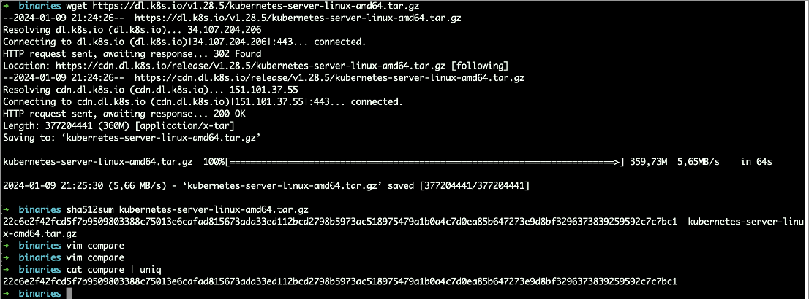

# Review your downloaded Kubernetes Binaries

The purpose of this lab is to get an overview how you can verify your Kubernetes binaries.

## Required for this course

Installed tool which is called "sha512sum". 
For installation purposes, please this this link: https://command-not-found.com/sha512sum

## Opening the Kubernetes download page
Open the github page of kubernetes: https://github.com/kubernetes/kubernetes/releases
Choose your version and click "changelog".
Select the binaries you want to download. 

In this example, we want to download Kubernetes 1.28.5: https://github.com/kubernetes/kubernetes/blob/master/CHANGELOG/CHANGELOG-1.28.md#server-binaries-1
And then the server binaries "kubernetes-server-linux-amd64.tar.gz"


## Verify the downloaded binaries via Sha512sum
Open the github page of kubernetes: https://github.com/kubernetes/kubernetes/releases
Choose your version and click "changelog".

```bash
wget https://dl.k8s.io/v1.28.5/kubernetes-server-linux-amd64.tar.gz
sha512sum kubernetes-server-linux-amd64.tar.gz
```

You can copy and paste the sha512 hash of the website and the string you got back of the sha512sum into a text editor to compare.

```bash
vim compare
cat compare | uniq
```




