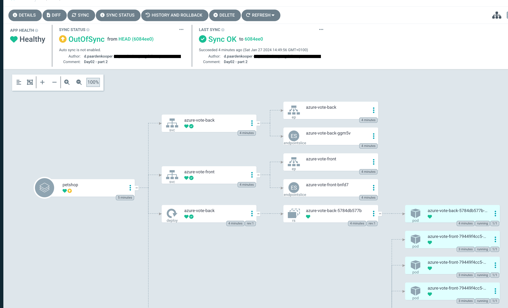
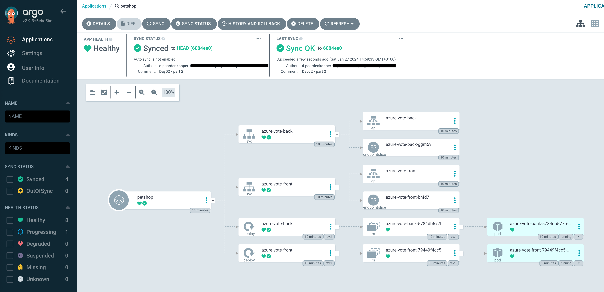

# Install and demo app
The purpose of this lab is to understand how to install argoCD and demonstrate an application
Install documentation can be found on this link: https://argo-cd.readthedocs.io/en/stable/getting_started/
Walktrough can be found here: https://www.youtube.com/watch?v=Yb3_4PZX0B0

> **Remark**
> This is a demo how you can install and use it. Always check the docs for the latest updates!


## Required for this course
An running Kubernetes environment. Access with your client to the Kubernetes environment with permissions to install the argocd cli.
When you are running in an airgapped environment, this demo does not going to work.

## Install ArgoCD
Run the following commands on your environment to install ArgoCD.

```bash
kubectl create namespace argocd
kubectl apply -n argocd -f https://raw.githubusercontent.com/argoproj/argo-cd/stable/manifests/install.yaml
```

## Download the ArgoCD cli
If you have a Mac system, use the line below. If you are using an other edition, please check this link: https://argo-cd.readthedocs.io/en/stable/cli_installation/

```bash
brew install argocd
```

## Access the ArgoCD API Server
By default, the Argo CD API server is not exposed with an external IP. To access the API server, choose one of the following techniques to expose the Argo CD API server:

- Option 1: Change the argocd-server service type to LoadBalancer:

```bash
kubectl patch svc argocd-server -n argocd -p '{"spec": {"type": "LoadBalancer"}}'
```

- Option 2: ingress rule. Pleases check the docs: https://argo-cd.readthedocs.io/en/stable/operator-manual/ingress/

```bash
kubectl patch svc argocd-server -n argocd -p '{"spec": {"type": "LoadBalancer"}}'
```

- Option 3: port forwarding

```bash
kubectl port-forward svc/argocd-server -n argocd 8080:443
```

## Access the ArgoCD API Server
The initial password for the admin account is auto-generated and stored as clear text in the field password in a secret named argocd-initial-admin-secret in your Argo CD installation namespace. You can simply retrieve this password using the argocd CLI:

```bash
argocd admin initial-password -n argocd
```

Using the username admin and the password from above, login to Argo CD's IP or hostname:

```bash
argocd login <ARGOCD_SERVER>
```

> **Warning**
> This is a demo. Always check the docs for the latest updates! You should delete the argocd-initial-admin-secret from the Argo CD namespace once you changed the password. The secret serves no other purpose than to store the initially generated password in clear and can safely be deleted at any time. It will be re-created on demand by Argo CD if a new admin password must be re-generated.

You can change the password using the command:

```bash
argocd account update-password
```

But let's leave it for now.


## Login with the argocd cli
To make it work, in this lab we have choosen option 1. 
This means that the Argo API server has got an public IP address. Normaly you shouldn't do this and use ingress instead.
For training purposes and the understanding, choose option 1 and proceed.

First we need the public IP address. To get this, please do the following command:

```bash
kubectl get svc -A
```

Look up the IP from the "argocd-server" which has as type "Loadbalancing". You need the IP address.
Now you can log in with the "argocd cli".

```bash
argocd login <IP Address>
```

## Register a Cluster to ArgoCD API Server
This step registers a cluster's credentials to Argo CD, and is only necessary when deploying to an external cluster. When deploying internally (to the same cluster that Argo CD is running in), https://kubernetes.default.svc should be used as the application's K8s API server address.

```bash
kubectl config get-contexts -o name
```

You probably get a small list (hopefully). 

Choose a context name (aks-course-weu-01) from the list and supply it to argocd cluster add CONTEXTNAME. 
In our example, for aks-course-weu-01 context, run:

```bash
argocd cluster add aks-course-weu-01
```

Now the cluster is enabled! You get a message "succesfull" and a following message will appear:

```bash
WARNING: This will create a service account `argocd-manager` on the cluster referenced by context `aks-course-weu-01` with full cluster level privileges. Do you want to continue [y/N]? y

INFO[0002] ServiceAccount "argocd-manager" already exists in namespace "kube-system" 
INFO[0002] ClusterRole "argocd-manager-role" updated    
INFO[0002] ClusterRoleBinding "argocd-manager-role-binding" updated 
Cluster '<CLUSTER URL>:443' added
```

## Create an application from a Git Repository
First we need to set the current namespace to argocd running the following command:

```bash
kubectl config set-context --current --namespace=argocd
```

Create the example guestbook application with the following command:

```bash
argocd app create guestbook --repo https://github.com/argoproj/argocd-example-apps.git --path guestbook --dest-server https://kubernetes.default.svc --dest-namespace default
```

## Sync (Deploy) The Application
Once the guestbook application is created, you can now view its status:

```bash
argocd app get guestbook
```

The application status is initially in OutOfSync state since the application has yet to be deployed, and no Kubernetes resources have been created. To sync (deploy) the application, run:

```bash
argocd app sync guestbook
```

## Create second application from a Git Repository
First we need to set the current namespace to argocd running the following command:

```bash
argocd app create petshop --repo https://github.com/dpaardenkooper/K8S-Course.git --path Day01/Demo-apps/azure-votingapp --dest-server https://kubernetes.default.svc --dest-namespace default
argocd app sync petshop
```

With this we can play.
First scale the deployment up to 10

```bash
kubectl -n default scale deploy azure-vote-front --replicas=10
```

Check ArgoCD UI. You should see something like this.



Rightclick "petshop" and click sync. This result in minimizing the replicas to 1.



## Git changes
The final test is of course to make changes to the Kubernetes files on git.
If you have cloned this repository, you can go to the following path "Day01/Demo-apps/azure-votingapp" and make the change in the "Azure_voting_app.yaml" file. Here you can make the same change.

Depending the configuration which you can enforce, ArgoCD will notice it and ask you what to do.
Make the change beneath in the file, by changing the number from 1 to 15 and see what happens: 

```bash
apiVersion: apps/v1
kind: Deployment
metadata:
  name: azure-vote-front
spec:
  replicas: 15
  selector:
    matchLabels:
      app: azure-vote-front
  template:
    metadata:
      labels:
        app: azure-vote-front
    spec:
      nodeSelector:
        "beta.kubernetes.io/os": linux
      containers:
      - name: azure-vote-front
        image: mcr.microsoft.com/azuredocs/azure-vote-front:v1
        resources:
          requests:
            cpu: 100m
            memory: 128Mi
          limits:
            cpu: 250m
            memory: 256Mi
        ports:
        - containerPort: 80
        env:
        - name: REDIS
          value: "azure-vote-back"
```

Save the change and commit it to your git.
